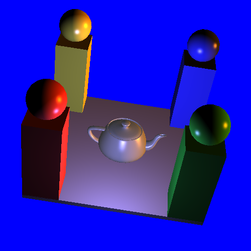

## UC San DiegoX CSE167x Computer Graphics
### <a href="https://www.edx.org/course/computer-graphics-2">Course link</a>

### Homework 0 (Compilation)

### Homework 1 (Transformations and Viewing)

### Homework 2 (OpenGL and Lighting)

### Homework 3 (Ray Tracing) 
### in progress...

